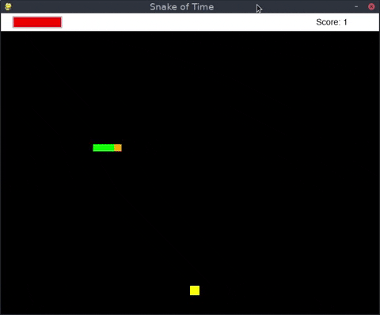

# Snake of Time

The usual snake game, but with ability to turn back time.



## Menu settings
It's possible to change next settings in the menu:

* change difficulty (different speed of the game)
* turn on/off "predictable future" (It means all eaten food will be in the same place after turning back time).

## How to run
Install all dependencies:

```bash
pip install -r requirements.txt
```

And then run the main script:

```bash
python snake.py
```
